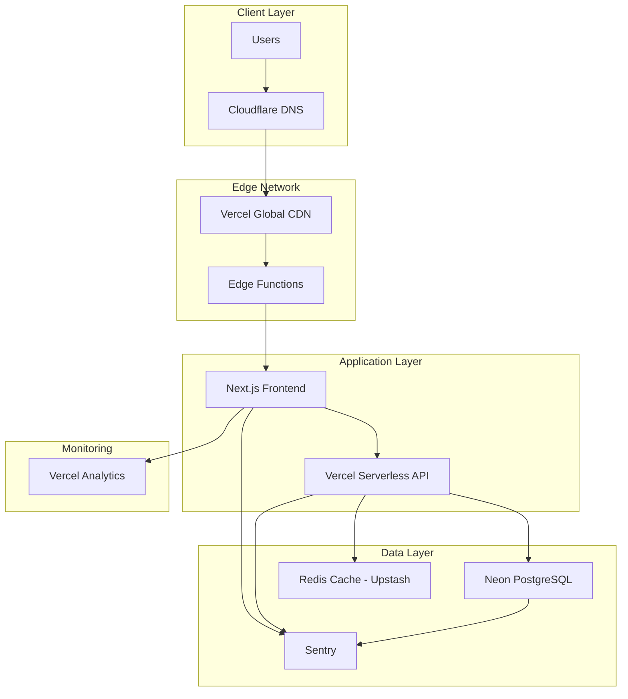

# TypeAmp Deployment Infrastructure

## 🚀 Overview

This document outlines the complete deployment infrastructure for TypeAmp, utilizing modern cloud platforms optimized for performance, scalability, and cost-effectiveness.

## 📊 Tech Stack - Production

### Frontend Hosting: Vercel
- **Platform**: Vercel (Next.js optimized)
- **Why Vercel**:
  - Native Next.js support with zero-config deployment
  - Automatic HTTPS and SSL certificates
  - Global CDN with 100+ edge locations
  - Serverless functions for API routes
  - Automatic preview deployments for PRs
  - Built-in analytics and Web Vitals monitoring
  - Free tier sufficient for initial launch

### Backend Hosting: Vercel Serverless Functions
- **Platform**: Vercel Serverless Functions
- **Architecture**: Serverless API endpoints
- **Benefits**:
  - Automatic scaling
  - Pay-per-use pricing
  - No server management
  - Integrated with frontend deployment

### Database: Neon
- **Platform**: Neon (Serverless PostgreSQL)
- **Why Neon**:
  - Serverless PostgreSQL with automatic scaling
  - Built-in connection pooling
  - Branching for development/staging environments
  - Pay-per-use pricing (scales to zero)
  - Generous free tier (3GB storage per branch)
  - Works perfectly with Prisma ORM
  - Instant database provisioning

### Monitoring & Analytics
- **Application Monitoring**: Sentry
- **Analytics**: Vercel Analytics + Google Analytics
- **Uptime Monitoring**: Better Uptime
- **Performance**: Vercel Web Vitals

## 🏗️ Deployment Architecture



## 🌍 Environments

### Production
- **URL**: https://typeamp.com
- **Branch**: main
- **Auto-deploy**: Yes
- **Environment**: production

### Staging
- **URL**: https://staging.typeamp.com
- **Branch**: develop
- **Auto-deploy**: Yes
- **Environment**: staging

### Preview
- **URL**: https://[branch]-typeamp.vercel.app
- **Branch**: feature/* (PR deployments)
- **Auto-deploy**: Yes
- **Environment**: preview

## 🔧 Environment Variables

### Frontend (.env.production)
```env
# Public variables (exposed to browser)
NEXT_PUBLIC_API_URL=https://typeamp.com/api
NEXT_PUBLIC_APP_URL=https://typeamp.com
NEXT_PUBLIC_SENTRY_DSN=your-sentry-dsn
NEXT_PUBLIC_GA_ID=G-XXXXXXXXXX
NEXT_PUBLIC_ENVIRONMENT=production

# Build-time variables
ANALYZE=false
SENTRY_AUTH_TOKEN=your-sentry-auth-token
```

### Backend (Vercel Environment Variables)
```env
# Database (Neon)
DATABASE_URL=postgresql://[user]:[password]@[project].neon.tech/[database]?sslmode=require
DIRECT_URL=postgresql://[user]:[password]@[project].neon.tech/[database]?sslmode=require

# Authentication
JWT_SECRET=your-secure-jwt-secret
JWT_EXPIRY=7d

# External Services
SENTRY_DSN=your-backend-sentry-dsn
REDIS_URL=redis://default:[password]@[host]:[port]

# Security
CORS_ORIGIN=https://typeamp.com
RATE_LIMIT_WINDOW=15m
RATE_LIMIT_MAX=100

# Feature Flags
ENABLE_AI_FEATURES=true
ENABLE_MULTIPLAYER=false
```

## 🚀 Deployment Process

### 1. Initial Setup

```bash
# Install Vercel CLI
npm i -g vercel

# Login to Vercel
vercel login

# Link project
vercel link

# Set up environment variables
vercel env add DATABASE_URL
vercel env add JWT_SECRET
# ... add all required env vars
```

### 2. Database Setup (Neon + Prisma)

```bash
# Create Neon database
# 1. Sign up at https://neon.tech
# 2. Create a new project
# 3. Copy the connection string

# Set up Prisma with Neon
cd packages/api

# Update DATABASE_URL in .env
echo "DATABASE_URL=postgresql://..." > .env

# Run Prisma migrations
npx prisma generate
npx prisma db push

# Seed initial data (if needed)
npm run seed
```

### 3. Deployment Configuration

Create `vercel.json`:
```json
{
  "framework": "nextjs",
  "buildCommand": "npm run build",
  "devCommand": "npm run dev",
  "installCommand": "npm ci",
  "regions": ["iad1"],
  "functions": {
    "packages/web/src/app/api/*": {
      "runtime": "nodejs20.x",
      "maxDuration": 10
    }
  },
  "headers": [
    {
      "source": "/(.*)",
      "headers": [
        {
          "key": "X-Content-Type-Options",
          "value": "nosniff"
        },
        {
          "key": "X-Frame-Options",
          "value": "DENY"
        },
        {
          "key": "X-XSS-Protection",
          "value": "1; mode=block"
        },
        {
          "key": "Referrer-Policy",
          "value": "strict-origin-when-cross-origin"
        },
        {
          "key": "Permissions-Policy",
          "value": "camera=(), microphone=(), geolocation=()"
        }
      ]
    }
  ],
  "rewrites": [
    {
      "source": "/api/:path*",
      "destination": "/api/:path*"
    }
  ]
}
```

## 🔒 Security Configuration

### SSL/TLS
- **Provider**: Vercel (automatic)
- **Certificate**: Let's Encrypt
- **Renewal**: Automatic
- **HSTS**: Enabled with max-age=31536000

### Security Headers
```javascript
// middleware.ts
export function middleware(request: NextRequest) {
  const response = NextResponse.next();
  
  // Security headers
  response.headers.set('X-DNS-Prefetch-Control', 'on');
  response.headers.set('Strict-Transport-Security', 'max-age=31536000; includeSubDomains');
  response.headers.set('X-Content-Type-Options', 'nosniff');
  response.headers.set('X-Frame-Options', 'SAMEORIGIN');
  response.headers.set('X-XSS-Protection', '1; mode=block');
  response.headers.set('Referrer-Policy', 'strict-origin-when-cross-origin');
  
  // CSP
  response.headers.set(
    'Content-Security-Policy',
    "default-src 'self'; script-src 'self' 'unsafe-eval' 'unsafe-inline' *.vercel-insights.com *.google-analytics.com; style-src 'self' 'unsafe-inline'; img-src 'self' data: https:; font-src 'self'; connect-src 'self' *.supabase.co *.sentry.io vitals.vercel-insights.com"
  );
  
  return response;
}
```

### Rate Limiting
```typescript
// lib/rate-limit.ts
import { Ratelimit } from '@upstash/ratelimit';
import { Redis } from '@upstash/redis';

export const rateLimiter = new Ratelimit({
  redis: Redis.fromEnv(),
  limiter: Ratelimit.slidingWindow(100, '15 m'),
  analytics: true,
});
```

## 📊 Monitoring Setup

### 1. Sentry Configuration
```typescript
// sentry.client.config.ts
import * as Sentry from '@sentry/nextjs';

Sentry.init({
  dsn: process.env.NEXT_PUBLIC_SENTRY_DSN,
  environment: process.env.NEXT_PUBLIC_ENVIRONMENT,
  tracesSampleRate: 0.1,
  replaysSessionSampleRate: 0.1,
  replaysOnErrorSampleRate: 1.0,
  integrations: [
    Sentry.replayIntegration(),
  ],
});
```

### 2. Vercel Analytics
```typescript
// app/layout.tsx
import { Analytics } from '@vercel/analytics/react';
import { SpeedInsights } from '@vercel/speed-insights/next';

export default function RootLayout({ children }) {
  return (
    <html>
      <body>
        {children}
        <Analytics />
        <SpeedInsights />
      </body>
    </html>
  );
}
```

### 3. Custom Monitoring Dashboard
```typescript
// lib/monitoring.ts
export const trackEvent = (name: string, properties?: Record<string, any>) => {
  // Vercel Analytics
  if (window.va) {
    window.va('event', name, properties);
  }
  
  // Google Analytics
  if (window.gtag) {
    window.gtag('event', name, properties);
  }
  
  // Custom backend tracking
  fetch('/api/analytics/event', {
    method: 'POST',
    body: JSON.stringify({ name, properties }),
  });
};
```

## 🔄 CI/CD Integration

### GitHub Actions Deployment
```yaml
# .github/workflows/deploy.yml
name: Deploy to Vercel

on:
  push:
    branches: [main, develop]
  pull_request:
    types: [opened, synchronize]

jobs:
  deploy:
    runs-on: ubuntu-latest
    steps:
      - uses: actions/checkout@v3
      
      - name: Deploy to Vercel
        uses: amondnet/vercel-action@v25
        with:
          vercel-token: ${{ secrets.VERCEL_TOKEN }}
          vercel-org-id: ${{ secrets.VERCEL_ORG_ID }}
          vercel-project-id: ${{ secrets.VERCEL_PROJECT_ID }}
          vercel-args: ${{ github.ref == 'refs/heads/main' && '--prod' || '' }}
```

## 💰 Cost Analysis

### Monthly Cost Estimate (Initial Launch)
- **Vercel Pro**: $20/month
  - 1TB bandwidth included
  - Unlimited serverless executions
  - Team collaboration features
- **Neon Free**: $0/month
  - 3GB storage per branch
  - 1 compute hour per day
  - Unlimited branches
- **Upstash Redis Free**: $0/month
  - 10,000 commands daily
  - 256MB storage
- **Sentry Developer**: $0/month
  - 5K errors/month
  - 10K transactions
- **Total**: ~$20/month

### Scaling Costs (10K+ users)
- **Vercel Pro**: $20/month + $40/TB extra bandwidth
- **Neon Pro**: $19/month
  - 10GB storage
  - Unlimited compute
  - Point-in-time recovery
- **Upstash Pay-as-you-go**: ~$10/month
- **Sentry Team**: $26/month
- **Estimated Total**: ~$75/month + bandwidth

## 📈 Performance Optimization

### Edge Functions
```typescript
// middleware.ts - Geo-based routing
export function middleware(request: NextRequest) {
  const country = request.geo?.country || 'US';
  
  // Route to nearest data center
  if (country === 'EU') {
    request.nextUrl.pathname = '/api/eu' + request.nextUrl.pathname;
  }
  
  return NextResponse.rewrite(request.nextUrl);
}
```

### Static Optimization
```typescript
// next.config.js
module.exports = {
  images: {
    domains: ['typeamp.com'],
    formats: ['image/avif', 'image/webp'],
  },
  staticPageGenerationTimeout: 120,
  experimental: {
    optimizeCss: true,
    optimizePackageImports: ['@radix-ui/*'],
  },
};
```

## 🔄 Backup & Recovery

### Database Backups (Neon)
- **Automated**: Continuous backups with Neon
- **Branching**: Create instant database branches for testing
- **Point-in-time recovery**: 7 days (free), 30 days (pro)
- **Zero-downtime migrations**: Using Prisma migrations

### Backup Strategy
```bash
# Backup script using Prisma
#!/bin/bash
# backup.sh

# Export Vercel environment
vercel env pull .env.backup

# Create Neon branch for backup
neon branch create backup-$(date +%Y%m%d)

# Export schema and data using Prisma
npx prisma db pull
npx prisma migrate diff --from-empty --to-schema-datamodel prisma/schema.prisma --script > backup-$(date +%Y%m%d).sql

# Upload to S3/B2
aws s3 cp backup-*.sql s3://typeamp-backups/
```

## 🚨 Incident Response

### Monitoring Alerts
1. **Uptime**: Better Uptime → PagerDuty → On-call engineer
2. **Errors**: Sentry → Slack → Development team
3. **Performance**: Vercel Analytics → Email → DevOps team

### Rollback Procedure
```bash
# Instant rollback in Vercel
vercel rollback

# Or via dashboard
# 1. Go to Vercel Dashboard
# 2. Select deployment
# 3. Click "Promote to Production"
```

## 📋 Deployment Checklist

### Pre-deployment
- [ ] All tests passing
- [ ] Environment variables configured
- [ ] Database migrations tested
- [ ] Security headers verified
- [ ] Performance budgets met
- [ ] Monitoring configured

### Deployment
- [ ] Deploy to staging
- [ ] Run smoke tests
- [ ] Verify monitoring
- [ ] Deploy to production
- [ ] Verify SSL/DNS
- [ ] Test critical paths

### Post-deployment
- [ ] Monitor error rates
- [ ] Check performance metrics
- [ ] Verify analytics
- [ ] Update status page
- [ ] Notify stakeholders
- [ ] Document any issues

## 🔗 Resources

- [Vercel Documentation](https://vercel.com/docs)
- [Supabase Documentation](https://supabase.com/docs)
- [Next.js Deployment](https://nextjs.org/docs/deployment)
- [TypeAmp Status Page](https://status.typeamp.com)
- [TypeAmp Analytics Dashboard](https://analytics.typeamp.com)